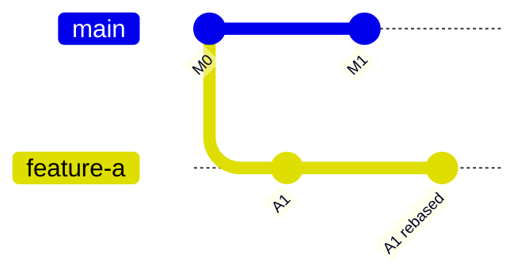

# Git Specialization

Use this reference when the course teaches Git branching, rebasing, pull requests, conflicts, review, or release flow.

## Mapping

Generic course arc to Git:

```text
prototype              -> direct change on main
reusable structure     -> branch workflow
configuration          -> repo settings and branch protection
tests                  -> CI checks
automation             -> GitHub Actions
observability          -> git log, graph, PR checks
artifact boundaries    -> generated files ignored
documentation          -> command guide and diagrams
handoff                -> PR review and merge
```

## Example Arc

For a two-developer branching course:

1. One developer commits directly to `main`.
2. Introduce feature branches.
3. Developer A and Developer B diverge.
4. `main` moves while both branches exist.
5. Developer A rebases on `main`.
6. A conflict occurs.
7. Resolve conflict and continue rebase.
8. Force push with lease.
9. Open PR and let CI verify.
10. Merge.

## Commands To Teach

```bash
git switch -c feature/name
git fetch origin
git rebase origin/main
git status
git diff
git add <file>
git rebase --continue
git rebase --abort
git log --oneline --graph --all
git push --force-with-lease
```

## Safety Rules

- Teach `--force-with-lease`, not plain `--force`.
- Warn against rebasing shared branches without team agreement.
- Resolve conflicts by understanding intent.
- Use CI to verify the branch after rebase.
- Show commit IDs changing after rebase.

## Repo Shape

```text
README.md
docs/
scripts/
  setup_demo_repo.sh
  simulate_developer_a.sh
  simulate_developer_b.sh
  reset_demo.sh
.github/workflows/ci.yml
_quarto.yml
index.qmd
```

## Diagrams

Use Mermaid `gitGraph` for history:



Keep diagrams aligned with the actual script-generated history.
