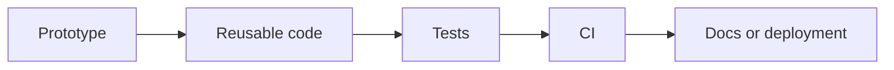

# Teaching Arc

Use this reference when planning the course outline, repository stages, notebooks, or docs pages.

## Core Pattern

The reusable story is:

```text
prototype
-> reusable structure
-> configuration
-> tests
-> automation
-> observability
-> artifact/state boundaries
-> documentation
-> publishing or deployment
```

The exact tools change by domain. The teaching movement should stay the same: learners see why each engineering practice exists because it solves a concrete collaboration, trust, reproducibility, or maintenance problem.

## Lesson Structure

A strong course repo usually has 4-6 stages:

1. **Prototype**: one person makes something work.
2. **Collaboration**: another person needs to change or rerun it.
3. **Reusable Core**: factor logic into package/app code.
4. **Quality Gate**: add tests, validation, linting, or CI.
5. **Operational Feedback**: add logs, metrics, traces, artifacts, or previews.
6. **Handoff**: docs, deployment, publishing, or release workflow.

## Repository Shape

Prefer:

```text
docs/ or nbs/
src/ or package_name/
tests/
.github/workflows/
README.md
pyproject.toml or equivalent
config file
.gitignore
```

Use domain folders when needed:

```text
data/
models/
scripts/
infra/
app/
```

Keep placeholder files such as `.gitkeep` when a local runtime folder matters but its contents should not be versioned.

## Presentation Requirements

For every stage, include:

- a concrete scenario
- a command or runnable artifact
- the engineering problem being solved
- what changed in the repo
- a learner exercise

Avoid abstract best-practices lists unless they are tied back to the runnable example.

## Diagrams

Use Mermaid for simple flows:



For Git courses, use `gitGraph` diagrams when possible.
